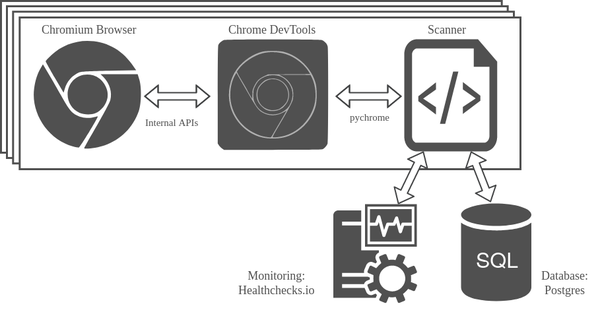

# Detecting Browser Extension Abuse in the Wild

This project provides a web scanning tool for analysing interactions between websites and browser extensions. It allows automated large-scale web studies targeting the security and privacy problems caused by these interactions.

## Overview

### Goal

The goal of this project is to identify websites that abuse browser extensions for malicious purposes. In particular, the following two issues are targeted.

* **Extension discovery using web accessible resources**
  * We detect if a website tries to discover which extensions are installed in a user’s browser using Web Accessible Resources (WARs).
  * Paper: *A. Sjösten, S. Van Acker, and A. Sabelfeld. "Discovering Browser Extensions via Web Accessible Resources"* ([Link](https://dl.acm.org/doi/10.1145/3029806.3029820))
* **Message Passing between websites and extensions**
  * There are several risks originating from the message passing APIs available for extensions and websites. We analyse which websites make use of these capabilities with a focus on potentially malicious behaviour. For this we save all messages sent on a website using `window.postMessage`, `runtime.sendMessage`, `runtime.connect` and `port.postMessage`.
  * Paper: *D. F. Somé. "EmPoWeb: Empowering Web Applications with Browser Extensions"* ([Link](https://ieeexplore.ieee.org/document/8835286))

### Features

This project consists of two parts.

1. A scanning system to perform web studies based on the Chrome DevTools Protocol.
2. An analysis tool for automated evaluations of the data collected by the scanners. Details regarding the specific evaluations can be found in [`analysis/README.md`](analysis/README.md).

### Approach

The scanner detects and saves requests to WARs. Additionally, all observed messages are collected.  These can be benign or malicious, which is decided in a later analysis step. The scanning process consists of the following six steps which are repeated for each scanned website.

1. Retrieve website URL from the list of domains to crawl.
2. Open website in new browser tab.
3. When the website has loaded, start recording potentially malicious behaviour.
4. Wait 20 seconds (while simulating user interaction).
5. Close the browser tab.
6. Save recorded data as results to the database.

### Scanning System Architecture

The detection logic is implemented as a Python program which uses the pychrome module for connecting to and controlling the Chrome DevTools Protocol which in turn controls the Chromium web browser. The three mentioned components all reside on the same server. In order to parallelise the scanning process it is possible to run multiple
instances of the scanner (on separate servers) simultaneously. 

The data collected by this tool is stored into a PostgreSQL database which can be installed on a separate database server. For being able to track the progress of a scan and potential errors or system crashes we employ the external monitoring system Healthchecks.io.



## Quick Start

In case you only want to scan a few websites or want to test the scanning system, you can follow this quick start guide consisting of only five steps. For performing larger scans, have a look at the following section where the usage for larger production environments is explained.

1. Clone this repository.
2. Install the following packages.

```shell
sudo apt-get install python3 python3-pip python3-dev libpq-dev chromium-browser git
```

1. Install all needed Python modules. 

```python
pip3 install -r scanner/requirements.txt
```

4. Disable the database and the healthchecks in `scanner/config.cfg` by setting the corresponding values to `False`. Moreover, create a new entry in the section `input` where the key is your computer's hostname (as given by the `hostname` command) and the value is the path to your input file, e.g. `myhost=../input_data/extscan01.csv`.
5. Start the scan.

```shell
cd scanner/
python3 main.py
```

## Scanner Usage

In order to perform large-scale studies it is necessary to analyse a large amount of websites. This can be archived by parallelising the scanning system. For example, a scanner can be a virtual machine (tested using Ubuntu 18.04.4 LTS) equipped with additional software. These scan servers can be configured and deployed using Ansible playbooks. 

### Step 1: Set Up

1. Create a fork of this repository. Depending on your use case make this a private repository.
2. Clone your new repository to your local development machine.

### Step 2: Input Data Generation

As input data, a list of domains to scan is required. For example, the [Tranco top-list](https://tranco-list.eu/) can be used for this. The input file must be a comma-separated CSV file containing the rank and the domain itself.

```
1,a.com
2,b.com
3,c.com
```

First, split the original input file up into multiple files so that each scanner processes a different list. For this configure the parameters in the Python file `scanner/inputgeneration/inputgenerator.py`. The following example creates 20 files containing URLs from the given input file. To distribute the URLs equally a chunking mechanism is used. The algorithm goes through the input file and always appends the next 25 URLs to an output file. Then it continues with the next file.

```python
InputGenerator.split_input_data_into_files(
    input_file="../input_data/top-1m.csv",
    output_directory="../input_data/top-1m/",
    n=20,
    chunk_size=25
)
```

Run the generator.

```shell
cd scanner/
python3 inputgeneration/inputgenerator.py
```

The following listing gives an example output for the input chunking algorithm for n = 2 and a chunk size of 5 (with numbers instead of URLs).

```
# Input
[0, 1, 2, 3, 4, 5, 6, 7, 8, 9, 10, 11, 12, 13]
# Output
0: [0, 1, 2, 3, 4, 10, 11, 12, 13]
1: [5, 6, 7, 8, 9]
```

Now add these files to your repository. This is important as the scan servers configured in the following steps will download their list of URLs directly from the repository.

```shell
git add input_data/top-1m/
git commit -m "Added input files"
git push origin master
```

### Step 3: Configuration

1. Create the input files with the domains to scan as described above.
2. Configure the scanner according to your needs in the file `scanner/config.cfg`. At least define which input fields to use in `[input]` and provide your database credentials in `[database]`. If you want to monitor your scan using *healthchecks.io* also add your `api_key` in `[healthcheck]`.
3. Define your Ansible inventory, i.e. the addresses of the scan and DB servers, in `ansible/hosts`.
4. Set your operating system credentials (for the VMs) and database credentials in `ansible/variables.yml`. Also define your Ansible user and if a jump server shall be used in this file.
5. Create an SSH deploy key that will be used by the scan servers to fetch the code from your (private) repository. Place your secret and public key in `ansible/files/id_rsa_deploy` and `ansible/files/id_rsa_deploy.pub` respectively and add the key to your repo's deploy keys on GitHub. This is not necessary when using a public repository.
6. Depending on the local network your scanners and database are running in, change the database access settings in `ansible/playbook_deploy_dbserver.yml`.

During deployment the source code and the URL input files will be cloned from the defined repository directly to the servers. Sensitive data should not reside within the repo, therefore `scanner/config.cfg` ,  `ansible/files/id_rsa_deploy` and `ansible/files/id_rsa_deploy.pub` will be uploaded from your local development machine to the servers.

### Step 4: Deployment

> **Important:** Please read through the playbooks carefully before running them for the first time. They are written targeting VMs that are solely used for the purpose of scanning  and modify the operating system. For example, snapd will be removed  from all scan servers (for storage capacity reasons).

To install all necessary servers perform the following steps in the given order.

First, reboot all servers.

```shell
ansible-playbook ansible/playbook_reboot.yml -K -i ansible/hosts
```

Deploy and configure all scan servers.

```shell
ansible-playbook ansible/playbook_deploy_scanserver.yml -K -i ansible/hosts
```

Deploy the database server and database.

```shell
ansible-playbook ansible/playbook_deploy_dbserver.yml -K -i ansible/hosts
```

### Step 5: Run

Start the scan on all servers.

```shell
ansible-playbook ansible/playbook_run_scan.yml -K -i ansible/hosts
```

During/after a scan, the log files can be downloaded using the following command.

```shell
ansible-playbook ansible/playbook_collect_logs.yml -K -i ansible/hosts
```

## Data Analysis

The analysis tool is described in detail in [`analysis/README.md`](analysis/README.md).

## License

This project is licensed under the terms of the MIT license.

